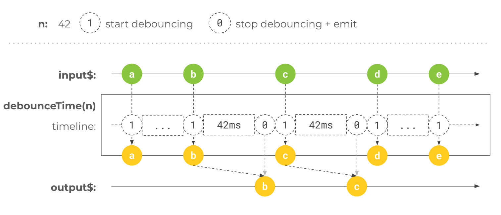
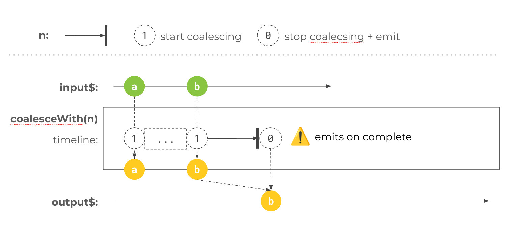

# Marble Testing & other rxjs testing approaches

# Goal

In this exercise we learn how to test rxjs code with the help of marble testing and rxjs' `TestScheduler`.
As a bonus, you will have the chance to compare marble testing against other approaches.

## coalesceWith

Your task is to write three test cases for the [`coalesceWith`](https://www.rx-angular.io/docs/cdk/coalescing#rxangular-coalescing-operators) custom operator from `@rx-angular/cdk`.
The operator works very similar to `debounce`. You define a time window that should be used to coalesce multiple emissions to a single
emission with only the latest value.


### Test Setup

For this exercise, we will work on the `/app/shared/coalesceWith.spec.ts` file.
To execute the test, simply run:

```bash
npm run test
```

Or execute it directly via your IDE, in case you are using `WebStorm` or any other intellij product.

### should coalesce sync emissions to microTask



Write a test that confirms `coalesceWith` is able to coalesce synchronous events `(ab)` into single emissions `b`.

As a source, use `const source = cold('---(ab)--(ab)--(ab)|');`.

Use the `coalesceWith` operator on the source with `scheduled([], asapScheduler)` in order to coalesce on micro task.

Specify the correct expected value and implement the test.

<details>
    <summary>Solution</summary>

```ts
// app/shared/coalesceWith.spec.ts

it('should coalesce sync emissions to microTask', () => {
    testScheduler.run((helpers) => {
        const { cold, expectObservable } = helpers;
        const source = cold('       ---(ab)--(ab)--(ab)|');
        const expected: string = '  ---b-----b-----b---|';
        const result = source.pipe(
            coalesceWith(scheduled([], asapScheduler)),
        );
        expectObservable(result).toBe(expected);
    });
})

```

</details>


### should emit last value if source completes before durationSelector

Write a test that confirms `coalesceWith` emits the latest value when the source completes.

As a source, use `const source = cold('---a 100ms b|')`. This mimics a keydown event with a 100ms pause in between.
The source completes after emitting `b`.

Use the `coalesceWith` operator on the source with `timer(200)` in order to install a 200ms coalescing timer. 

Specify the correct expected value and implement the test.

<details>
    <summary>Solution</summary>

```ts
// app/shared/coalesceWith.spec.ts

it('should coalesce sync emissions to microTask', () => {
    testScheduler.run((helpers) => {
        const { cold, expectObservable } = helpers;
        const source = cold('       ---a 100ms b|   ');
        const expected: string = '  ---- 100ms -(b|)';
        const result = source.pipe(
            coalesceWith(timer(200)),
        );
        expectObservable(result).toBe(expected);
    });
})

```

</details>

### should emit when durationSelector completes



Write a test that confirms `coalesceWith` is emitting the latest value when the durationSelector completes.

As a source, use `const source = cold('---a 400ms b 100ms |');`. This mimics a stream that emits a on frame 4, b on frame 405 and completes
on frame 506.

In order to build a completing durationSelector, make use of the `cold` helper: `const coalescingDuration = cold('-----|');`

Use the `coalesceWith` operator on the source with `coalescingDuration` in order to setup coalescing for some frames.

Specify the correct expected value and implement the test.

<details>
    <summary>Solution</summary>

```ts
// app/shared/coalesceWith.spec.ts

it('should emit last value when durationSelector completes', () => {
    testScheduler.run((helpers) => {
        const { cold, expectObservable } = helpers;
        const source = cold('       ---a 400ms b 100ms |');
        const expected: string = '  --- 5ms a 400ms b 95ms |';
        const coalescingDuration = cold('-----|');
        const result = source.pipe(
            coalesceWith(coalescingDuration)
        );
        expectObservable(result).toBe(expected);
    });
});

```

</details>

## Bonus: Use subscribe & done approach

Pick one of the test cases and re-implement it with the `subscribe` & `done` approach.

<details>
    <summary>Hints</summary>

```ts
// app/shared/coalesceWith.spec.ts

import { concat, of, scheduled } from 'rxjs';
import { timer } from 'rxjs/src';

it('should coalesce sync emissions to microTask', (done) => {
    // without testscheduler
    // cold('---(ab)--(ab)--(ab)|')
    const source = concat(
        timer(3).pipe(switchMap(() => ['a', 'b'])),
        timer(2).pipe(switchMap(() => ['a', 'b'])),
        timer(2).pipe(switchMap(() => ['a', 'b'])),
    ).pipe(
        coalesceWith(scheduled([], asapScheduler))
    );
    
    source.subscribe({
        /* ---b-----b-----b--- */
        next: v => expect(v).toBe('b'),
        /*                   | */
        complete: () => done()
    });
})

```

</details>

## Bonus: Async await

<details>
    <summary>Hints</summary>

```ts
// app/shared/coalesceWith.spec.ts

import { concat, of, scheduled } from 'rxjs';
import { timer } from 'rxjs/src';

it('should coalesce sync emissions to microTask', async () => {
    // without testscheduler
    // cold('---(ab)--(ab)--(ab)|')
    const source = concat(
        timer(3).pipe(switchMap(() => ['a', 'b'])),
        timer(2).pipe(switchMap(() => ['a', 'b'])),
        timer(2).pipe(switchMap(() => ['a', 'b'])),
    ).pipe(
        coalesceWith(scheduled([], asapScheduler))
    );
    
    const values = [];
    
    await new Promise(resolve => {
        source.subscribe({
            /* ---b-----b-----b--- */
            next: v => values.push(v),
            /*                   | */
            complete: () => resolve()
        });
    });
    
    expect(values).toEqual(['b','b','b']);
})

```

</details>

## Bonus: Use observer-spy

```bash
npm install -D @hirez_io/observer-spy
```

<details>
    <summary>Hints</summary>

```ts
// app/shared/coalesceWith.spec.ts

import { concat, of, scheduled } from 'rxjs';

it('should coalesce sync emissions to microTask', async () => {
    // without testscheduler
    // cold('---(ab)--(ab)--(ab)|')
    const source = concat(
        timer(3).pipe(switchMap(() => ['a', 'b'])),
        timer(2).pipe(switchMap(() => ['a', 'b'])),
        timer(2).pipe(switchMap(() => ['a', 'b'])),
    ).pipe(
        coalesceWith(scheduled([], asapScheduler))
    );
    
    const spy = subscribeSpyTo(source);
    
    await spy.onComplete();
    
    expect(spy.getValues()).toEqual(['b','b','b']);
    
    source.subscribe({
        /* ---b-----b-----b--- */
        next: v => expect(v).toBe('b'),
        /*                   | */
        complete: () => done()
    });
})

```

</details>
